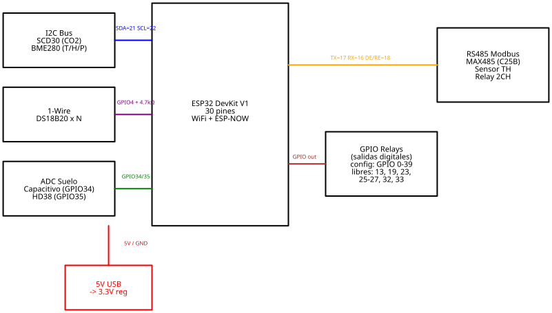
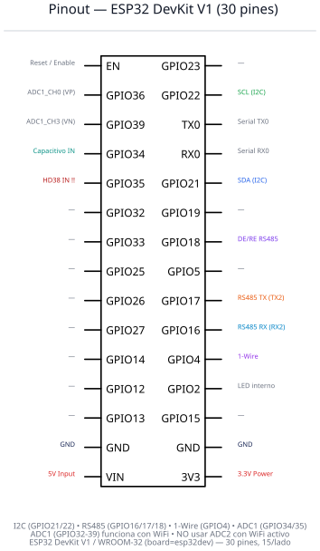
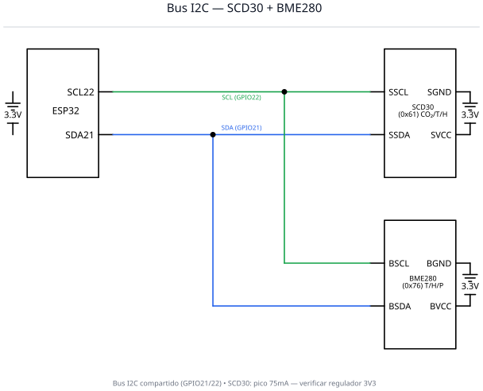
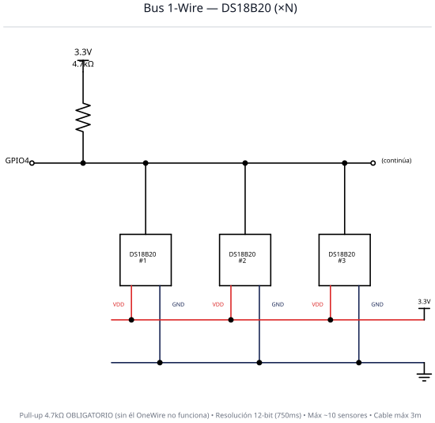
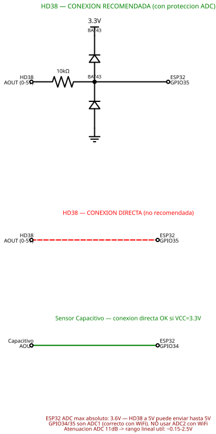
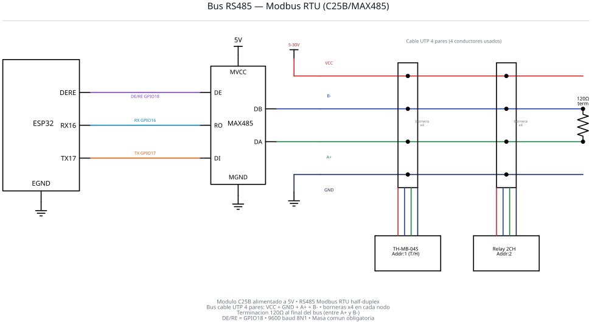

# Proyecto Plantinera — Documentación de Hardware

Esquemáticos y guía de montaje para el sistema de monitoreo basado en **ESP32 DevKit V1** (ESP32-WROOM-32, `board=esp32dev`): 30 pines, 15 por lado, 2×GND.

> **Nota de variante de placa**: el pinout corresponde al **DevKit V1 / NodeMCU de 30 pines**. Si tu placa es la variante de 38 pines (NodeMCU-32S), el orden físico difiere — verificar contra la serigrafía. Las asignaciones GPIO↔función (I2C 21/22, OneWire 4, ADC 34/35, RS485 16/17/18) provienen del firmware y son las mismas en cualquier variante.

## 📌 Tabla de Pinout

| GPIO | Función | Periférico | Protocolo | Notas |
|------|---------|-----------|-----------|-------|
| 21 | SDA | SCD30 + BME280 | I2C | Bus compartido |
| 22 | SCL | SCD30 + BME280 | I2C | Bus compartido |
| 4 | Data | DS18B20 × N | 1-Wire | Pull-up 4.7kΩ obligatorio |
| 34 | ADC IN | Sensor capacitivo | ADC1_CH6 | Input-only, 3.3V max |
| 35 | ADC IN | HD38 (suelo) | ADC1_CH7 | ⚠ AO puede superar 3.3V si VCC=5V |
| 17 | TX | C25B (DI) | UART2 | RS485 transmisión |
| 16 | RX | C25B (RO) | UART2 | RS485 recepción (ver Known Risks) |
| 18 | DE/RE | C25B | GPIO | Half-duplex control |

> **Nota:** GPIO34/35 son ADC1 (funcionan con WiFi activo). NO usar pines ADC2 (GPIO0,2,4,12-15,25-27) para lectura analógica con WiFi habilitado.

---

## 🔌 Conexiones por Bus

### I2C (GPIO21/22)
| Origen | Destino | Señal |
|--------|---------|-------|
| ESP32 GPIO21 | SCD30 SDA | I2C Data |
| ESP32 GPIO21 | BME280 SDA | I2C Data |
| ESP32 GPIO22 | SCD30 SCL | I2C Clock |
| ESP32 GPIO22 | BME280 SCL | I2C Clock |
| ESP32 3.3V | SCD30 VCC | Alimentación |
| ESP32 3.3V | BME280 VCC | Alimentación |

### OneWire (GPIO4)
| Origen | Destino | Señal |
|--------|---------|-------|
| ESP32 GPIO4 | DS18B20 DQ (todos) | Data bus |
| ESP32 3.3V | R 4.7kΩ → GPIO4 | Pull-up (obligatorio) |
| ESP32 3.3V | DS18B20 VDD (todos) | Alimentación |

### RS485 Modbus (GPIO16/17/18) — módulo **C25B alimentado a 5V**

**ESP32 ↔ C25B:**
| Origen | Destino | Señal |
|--------|---------|-------|
| ESP32 5V (VIN) | C25B VCC | Alimentación módulo (MAX485 requiere 5V) |
| ESP32 GPIO17 | C25B DI | TX data |
| ESP32 GPIO18 | C25B DE+RE | Direction control |
| C25B RO | ESP32 GPIO16 | RX data (directo — ver Known Risks) |
| C25B GND | ESP32 GND | Masa común |

**Bus Modbus (cable UTP 4 pares):**
| Conductor | Función | Notas |
|-----------|---------|-------|
| Par 1 — VCC | Alimentación 5-30V para periféricos | Externa (no del ESP32 3V3) |
| Par 2 — GND | Masa común del bus | Compartida con ESP32 |
| Par 3 — A+ (D+) | Línea diferencial + | Sale de C25B DA |
| Par 4 — B− (D−) | Línea diferencial − | Sale de C25B DB |

**Nodos (borneras x4 por nodo):**
| Nodo | Dispositivo | Addr Modbus |
|------|-------------|-------------|
| Bornera 1 | TH-MB-04S (sensor temp/hum) | 1 |
| Bornera 2 | Relay 2CH (actuador relay) | 2 |
| Fin de bus | Resistor 120Ω (terminación entre A+ y B−) | — |

> Cada bornera de 4 posiciones tap'ea los 4 conductores (VCC, GND, A+, B−) del cable UTP. La terminación 120Ω va al final del bus, entre A+ y B−.

### ADC Suelo (GPIO34/35)
| Origen | Destino | Señal |
|--------|---------|-------|
| ESP32 3.3V | Capacitivo VCC | Alimentación capacitivo |
| ESP32 5V (VIN) | HD38 VCC | Alimentación HD38 |
| ESP32 GND | Capacitivo GND, HD38 GND | Masa común |
| Capacitivo AOUT | ESP32 GPIO34 | Analog 0-3.3V (directo) |
| HD38 AOUT | ESP32 GPIO35 | Analog 0-5V (directo — ver Known Risks) |

---

## 📐 Esquemáticos

### Diagrama General del Sistema


### Pinout ESP32 DevKit V1


### Bus I2C — SCD30 + BME280


### Bus OneWire — DS18B20


### Sensores ADC — Suelo


### Bus RS485 — Modbus RTU


---

## 📦 BOM (Bill of Materials)

| # | Componente | Cantidad | Especificaciones | Función |
|---|-----------|----------|-----------------|---------|
| 1 | ESP32 DevKit V1 (WROOM-32) | 1 | 30 pines, WiFi+BT | MCU principal |
| 2 | Zócalo con bornes a tornillo | 1 | 2×15 pines, paso 2.54mm | Montaje ESP32 |
| 3 | SCD30 | 1 | I2C, 3.3V, Sensirion | CO₂ / Temp / Humedad |
| 4 | BME280 | 0-1 | I2C, 3.3V, Bosch | Temp / Humedad / Presión |
| 5 | DS18B20 | 1-10 | 1-Wire, 3.3V, Dallas | Temperatura (cadena) |
| 6 | Resistor 4.7kΩ | 1 | 1/4W | Pull-up OneWire (obligatorio) |
| 7 | Sensor capacitivo v2.0 | 0-1 | ADC, 3.3V | Humedad de suelo |
| 8 | HD38 | 0-1 | ADC+Digital, LM393, 5V | Humedad de suelo |
| 9 | Módulo C25B (MAX485) | 0-1 | 5V (azul básico) | Transceiver RS485 |
| 10 | Cable UTP 4 pares | 1 | longitud según instalación | Bus Modbus (VCC + GND + A+ + B−) |
| 11 | Bornera 4 posiciones | 1 por nodo | a tornillo, paso 5mm | Conexión bus ↔ dispositivo |
| 12 | TH-MB-04S | 0-1 | Modbus RTU, 5-30V | Sensor temp/hum remoto |
| 13 | Relay 2CH Modbus | 0-1 | Modbus RTU, 2×NO/NC | Actuador relay |
| 14 | Resistor 120Ω | 1 | 1/4W | Terminación bus RS485 (al final, entre A+ y B−) |
| 15 | Fuente USB 5V | 1 | ≥1A recomendado | Alimentación ESP32 + módulos 5V |
| 16 | Fuente externa 5-30V | 0-1 | según consumo de periféricos Modbus | Alimentación VCC del bus Modbus |

---

## ⚡ Power Budget

| Componente | Consumo típico | Consumo pico | Notas |
|-----------|---------------|-------------|-------|
| ESP32 (WiFi activo) | ~80mA | ~240mA | TX WiFi peaks |
| SCD30 | 19mA | **75mA** | Pico durante medición |
| BME280 | 0.003mA | 3.6mA | Modo forced |
| DS18B20 (×1) | 1mA | 1.5mA | 12-bit conversion |
| Capacitivo | 5mA | 5mA | Continuo |
| HD38 + LM393 | 15mA | 15mA | Continuo |
| C25B (MAX485) | 0.5mA | 1mA | Half-duplex — alimentado de **5V (VIN)**, no del rail 3.3V |
| **Total estimado** | **~120mA** | **~340mA** | |

> **Recomendación:** Fuente USB de 1A mínimo. El regulador 3.3V del DevKit típicamente soporta ~500mA, suficiente para esta configuración. Verificar si el pico del SCD30 (75mA) no causa brownout con WiFi TX simultáneo.

---

## ⚠️ Known Risks

Estos son riesgos conocidos del cableado **actual** del sistema. El sistema funciona en bench así, pero hay piezas operando fuera de spec — vale documentarlas.

### HD38 → GPIO35: AO puede superar 3.3V

El sensor HD38 alimentado a **5V** puede entregar hasta 5V por su salida analógica. El máximo absoluto de los pines del ESP32 es **3.6V**. El HW actual conecta AOUT directo a GPIO35 sin protección.

**Mitigación:** medir AO del HD38 con multímetro antes de cablear. Si AO supera 3.3V en condición seca, alimentar el HD38 a **3.3V** (si funciona correctamente a ese voltaje) o reemplazar por sensor capacitivo.

### C25B (MAX485) RO → GPIO16: 5V hacia un pin de 3.3V

El módulo **C25B** es un MAX485 genuino: requiere alimentación a **5V** (no funciona estable a 3.3V) y su salida RO entrega ~5V, por encima del máximo absoluto del ESP32 (3.6V). El HW actual conecta RO directo a GPIO16 sin protección.

Funciona por tolerancia de la pieza, pero está fuera de spec. Si se quema GPIO16, considerar:
- Alimentar el C25B a 3.3V (verificar que transmita estable a ese voltaje).
- Reemplazar por transceiver nativo 3.3V (MAX3485, SP3485).

### Bus RS485 — buenas prácticas obligatorias

- **Terminación 120Ω** al final del bus, entre A+ y B− (instalada en este sistema).
- **Masa común** entre ESP32, C25B, sensor TH y relay (a través del par GND del cable UTP).
- **Cable UTP 4 pares**: usar siempre A+ y B− del MISMO par trenzado para mejor inmunidad al ruido.

---

## 🔧 Troubleshooting

| Problema | Posible causa | Solución |
|---------|--------------|---------|
| SCD30/BME280 no detectado | Cableado I2C | Verificar SDA/SCL, 3.3V, GND |
| DS18B20 "0 sensors" | Pull-up faltante | Agregar 4.7kΩ entre GPIO4 y 3.3V |
| DS18B20 lee 85.0°C | Conversión incompleta | Aumentar delay, verificar cable |
| ADC siempre 0 o 4095 | Pin desconectado o saturado | Verificar conexión, voltaje <3.3V |
| ADC errático | Ruido | Agregar 0.1µF entre AOUT y GND |
| Modbus no responde | Polaridad RS485 | Swap A+/B−, verificar terminación 120Ω |
| Modbus intermitente | Sin masa común | Verificar continuidad del par GND del UTP |
| C25B no transmite | VCC insuficiente | Verificar 5V en VCC del C25B (no 3.3V) |
| Brownout/reboot | Corriente insuficiente | Fuente ≥1A, verificar regulador |
| GPIO35 reporta valores raros | HD38 entregando >3.3V | Medir AO con multímetro (ver Known Risks) |

---

## 🔗 Referencias al Firmware

- **Definición de pines:** [`include/sensors/`](../include/sensors/) — cada sensor define su GPIO
- **Configuración:** [`docs/CONFIGURATION.md`](../docs/CONFIGURATION.md) — `config.json` con pines configurables
- **Sensores detallado:** [`docs/SENSORS.md`](../docs/SENSORS.md) — specs, implementación, troubleshooting

---

## 🔄 Regenerar Esquemáticos

```bash
cd HardWare
make setup        # Crear venv e instalar dependencias
make schematics   # Generar todos los SVG
make clean        # Eliminar SVG generados
```

Los esquemáticos se generan con [schemdraw](https://schemdraw.readthedocs.io/) (Python → SVG).
Editar `generate_schematics.py` para modificar los diagramas.
